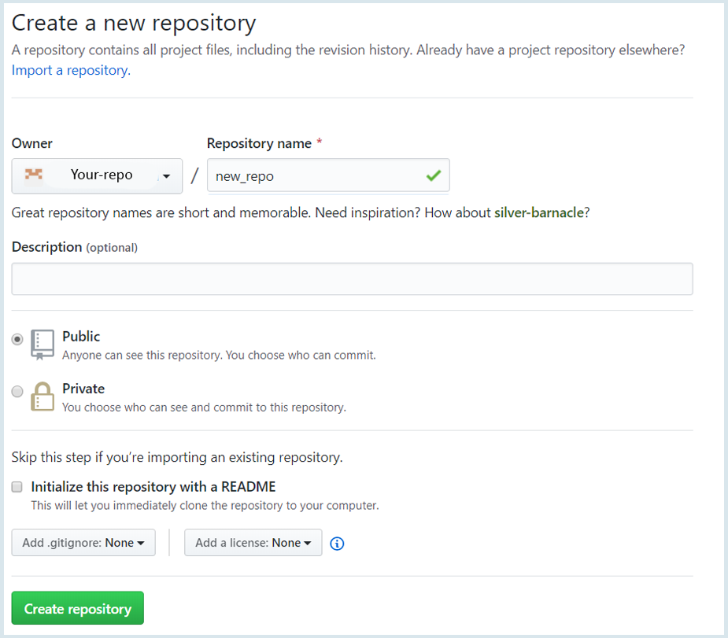
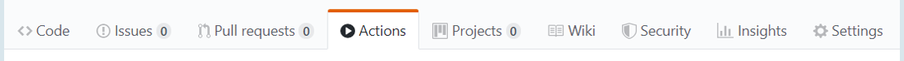

# Godzilla
This action perform chaos in your OpenStack project. It's realy depends waht percent you define.

## How it works:
Godzilla finds all the virtual machines in your OpenStack project and sorts them into two types “in server group or not” and use reboot type ‘HARD’ and wait for status ‘ACTIVE’.

## How to use Godzilla:
Create new repository on **github.com**
 

Choose **Actions** tab and create **Simple workflow**


Remove all text and paste this workflow:
```yaml
name: Godzilla
on: [push]
jobs:
  container-job:
    name: Implement Chaos
    runs-on: ubuntu-latest
    steps:
    - name: OpenStack Chaos Action
      uses: Viaceslav-Kodesh/Godzilla@master
      env:
          DELAY: ${{5}}  #minutes
          PERCENT: ${{50}}
          OS_USERNAME: ${{secrets.OS_USERNAME}}
          OS_AUTH_URL: ${{secrets.OS_AUTH_URL}}
          OS_PASSWORD: ${{secrets.OS_PASSWORD}}
          OS_TENANT_NAME: ${{secrets.OS_TENANT_NAME}}
          OS_PROJECT_NAME: ${{secrets.OS_PROJECT_NAME}}
          OS_NOVA_VERSION: ${{secrets.OS_NOVA_VERSION}}
          OS_USER_DOMAIN_NAME: ${{secrets.OS_USER_DOMAIN_NAME}}
```

Push **Start commit** button!
You should create **github secrets credentials** 

Looks like this:


If you input all OpenStack project credentials, you can start this **Actions!**


**As a result you can see in logs **
```ssh
Reboot machines in server groups
Server no_group-2 is in state ACTIVE
Server no_group-3 is in state ACTIVE
Server no_group-5 is in state ACTIVE
Server no_group-1 is in state ACTIVE
----------------------------------------

Reboot machines
Server test-1 is in state ACTIVE
Server 2nd-3 is in state ACTIVE
Server test-5 is in state ACTIVE
Server test-1 is in state ACTIVE
Server test-2 is in state ACTIVE
Server 2nd-5 is in state ACTIVE
Server 2nd-1 is in state ACTIVE
----------------------------------------
```
