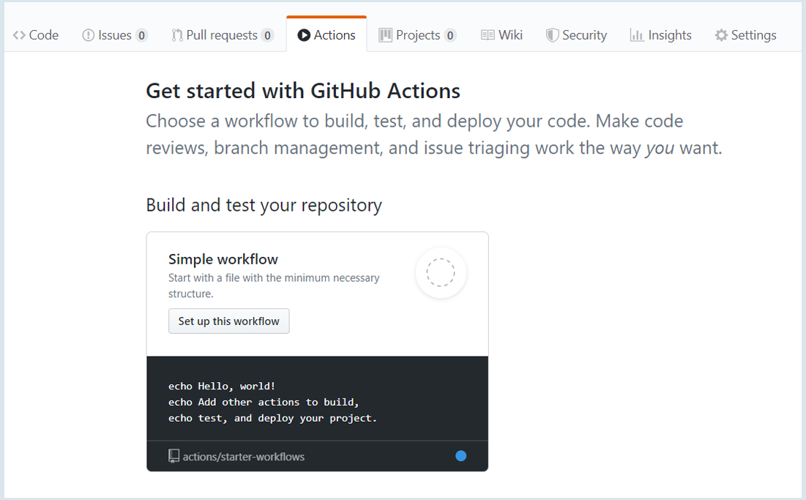
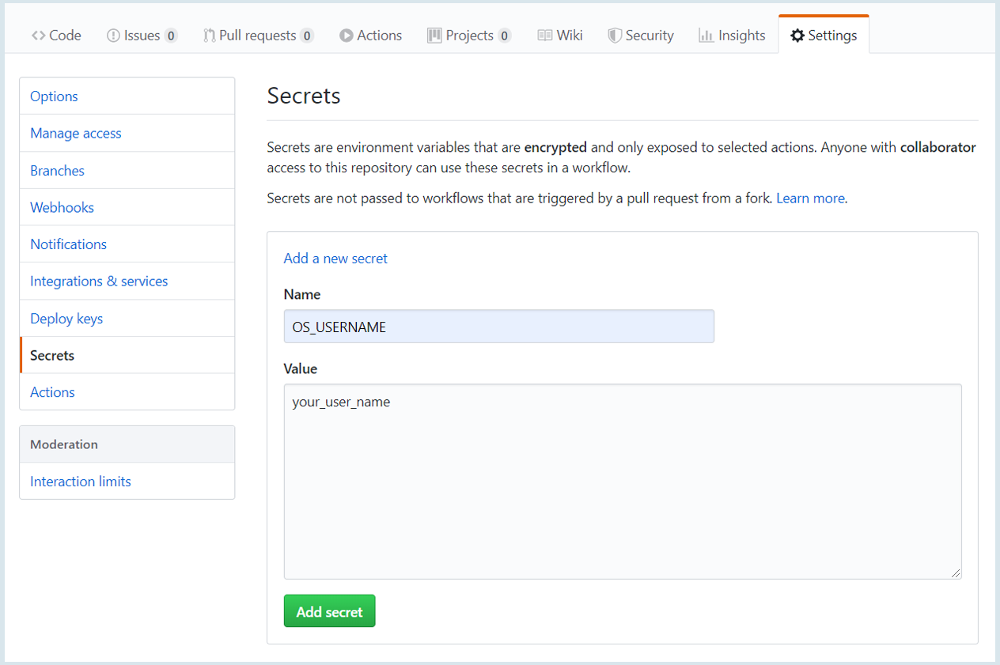
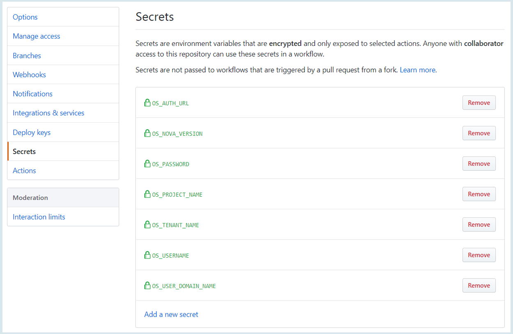

# Godzilla
This service can make it clear the level of resilience of your objects in OpenStack.

## How it works:
Godzilla finds all the virtual machines in your OpenStack project and sorts them into two types “in server group or not” and use reboot type ‘HARD’ and wait for status ‘ACTIVE’ you can control the count of virtual machines and chaos time.

## How to use Godzilla:
Should create new repository on **github.com**


Choose **Actions** tab and create **Simple workflow**


Remove all text and paste this workflow:

```
name: Godzilla
on: [push]
jobs:
  container-job:
    name: Implement Chaos
    runs-on: ubuntu-latest
    steps:
    - name: OpenStack Chaos Action
      uses: Viaceslav-Kodesh/Godzilla@master
      env:
          DELAY: ${{5}}  #minutes
          PERCENT: ${{50}}
          OS_USERNAME: ${{secrets.OS_USERNAME}}
          OS_AUTH_URL: ${{secrets.OS_AUTH_URL}}
          OS_PASSWORD: ${{secrets.OS_PASSWORD}}
          OS_TENANT_NAME: ${{secrets.OS_TENANT_NAME}}
          OS_PROJECT_NAME: ${{secrets.OS_PROJECT_NAME}}
          OS_NOVA_VERSION: ${{secrets.OS_NOVA_VERSION}}
          OS_USER_DOMAIN_NAME: ${{secrets.OS_USER_DOMAIN_NAME}}
```
Push **Start commit** button!

You should create **github secrets credentials**



Looks like this:


If you input all OpenStack project credentials, you can start this **Actions!**


Variable | Description |
--- | --- |
OS_USERNAME | login from project |
OS_AUTH_URL | openstack authentication url |
OS_PASSWORD | your password |
OS_TENANT_NAME | project id |
OS_PROJECT_NAME | project name |
OS_NOVA_VERSION | nova api version, now 2.0 |
OS_USER_DOMAIN_NAME | OpenStack domain |

**As a result you can see in logs**
```
Reboot machines in server groups
Server no_group-2 is in state ACTIVE
Server no_group-3 is in state ACTIVE
Server no_group-5 is in state ACTIVE
Server no_group-1 is in state ACTIVE
----------------------------------------

Reboot machines
Server test-1 is in state ACTIVE
Server 2nd-3 is in state ACTIVE
Server test-5 is in state ACTIVE
Server test-1 is in state ACTIVE
Server test-2 is in state ACTIVE
Server 2nd-5 is in state ACTIVE
Server 2nd-1 is in state ACTIVE
----------------------------------------
```
